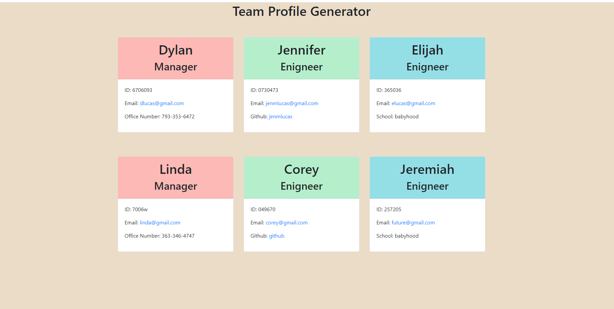

# Team Profile Generator 

## Description
Team Profile Generator is a command-line-input application that is run in Node. It uses the user input to create an HTML document to display their employee's roles and information. 

## Table of Contents
* [Installation](#installation)
* [Usage](#usage)
* [License](#license)
* [Contributing](#contributing)
* [Test](#test)
* [Questions](#questions)

## Installation
In order to use this application, the user should clone the repository from Github, install Node, Inquirer, and Jest. Then open a new terminal run "node index" and follow the prompts. 

## Usage
This is what the application will look like on your device.

[Github Link](https://github.com/jenmlucas/team-profile-generatorr)

## License
&copy; Copyright 2021, JenMLucas. All Rights Reserved

## Contributing
Jennifer Lucas = [Github](https://github.com/jenmlucas)

## Tests
Run "npm test" in the terminal to run jest for the tests on the constructors. 

## Questions
Please checkout my [Github](https://github.com/jenmlucas) for other projects. If you have any other questions or concerns, feel free to email me at jenmlucas1@gmail.com.

